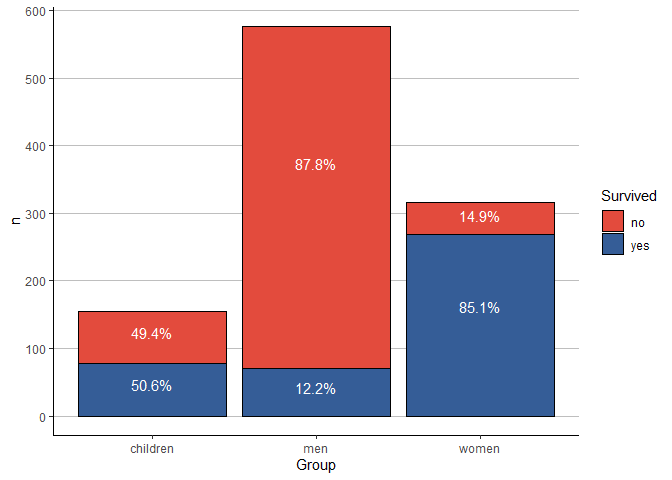
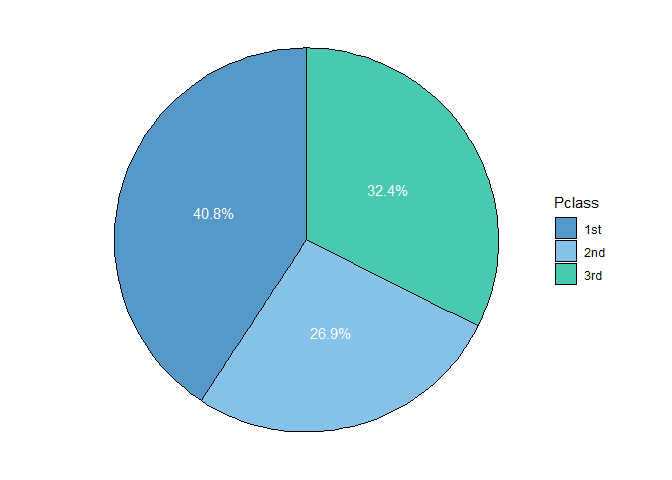

Breve análisis del Titanic
================

A continuación se presenta un breve análisis de los sobrevivientes del Titanic, realizado en R. Usaremos un dataset que contiene información de los pasajeros del Titanic. Los datos se pueden descargar de Kaggle: [data1](https://www.kaggle.com/hesh97/titanicdataset-traincsv) y [data2](https://www.kaggle.com/brendan45774/test-file). Cada fila corresponde a un pasajero, con 12 variables que registran la siguiente información:

1.  **PassengerId:** ID del pasajero
2.  **Survived:** Sobreviviente (0 = No, 1 = Si)
3.  **Pclass:** Clase de viaje (1 = 1st, 2 = 2nd, 3 = 3rd)
4.  **Name:** Nombre del pasajero
5.  **Sex:** Género del pasajero ("female", "male"")
6.  **Age:** Edad (en años) del pasajero
7.  **SibSp:** Número de hermanos/cónyuges a bordo
8.  **Parch:** Número de padres/hijos a bordo
9.  **Ticket:** Número de ticket/pasaje
10. **Fare:** Tarifa del pasajero
11. **Cabin:** Número de camarote
12. **Embarked:** Lugar de embarque ("C" = Cherbourg, "Q" = Queenstown, "S" = Southampton)

El objetivo de este analisis será responder a dos preguntas:

1.  ¿Se cumplió con la regla "mujeres y niños primero"?
2.  ¿Cómo se distribuye la clase (Pclass) en el grupo de sobrevivientes?

#### Importando librerías

Primero, importamos las librerías que nos van a ayudar en el manejo y visualización de los datos: dplyr y ggplot.

``` r
library(ggplot2)
library(dplyr)
```

#### Cargando los datos

Segundo, cargamos el dataset en formato csv con la función read.csv(). El conjunto de datos está dividido en dos subconjuntos, usualmente utilizados como train y test set en modelos de predicción y clasificación de aprendizaje automático. Con rbind() unimos ambos subconjuntos.

``` r
data1 <- read.csv("titanic_passengers_1.csv")
data2 <- read.csv("titanic_passengers_2.csv")
data <- rbind(data1, data2)
```

``` r
head(data, 5)
```

    ##   PassengerId Survived Pclass
    ## 1           1        0      3
    ## 2           2        1      1
    ## 3           3        1      3
    ## 4           4        1      1
    ## 5           5        0      3
    ##                                                  Name    Sex Age SibSp Parch
    ## 1                             Braund, Mr. Owen Harris   male  22     1     0
    ## 2 Cumings, Mrs. John Bradley (Florence Briggs Thayer) female  38     1     0
    ## 3                              Heikkinen, Miss. Laina female  26     0     0
    ## 4        Futrelle, Mrs. Jacques Heath (Lily May Peel) female  35     1     0
    ## 5                            Allen, Mr. William Henry   male  35     0     0
    ##             Ticket    Fare Cabin Embarked
    ## 1        A/5 21171  7.2500              S
    ## 2         PC 17599 71.2833   C85        C
    ## 3 STON/O2. 3101282  7.9250              S
    ## 4           113803 53.1000  C123        S
    ## 5           373450  8.0500              S

``` r
str(data)
```

    ## 'data.frame':    1309 obs. of  12 variables:
    ##  $ PassengerId: int  1 2 3 4 5 6 7 8 9 10 ...
    ##  $ Survived   : int  0 1 1 1 0 0 0 0 1 1 ...
    ##  $ Pclass     : int  3 1 3 1 3 3 1 3 3 2 ...
    ##  $ Name       : Factor w/ 1307 levels "Abbing, Mr. Anthony",..: 109 191 358 277 16 559 520 629 417 581 ...
    ##  $ Sex        : Factor w/ 2 levels "female","male": 2 1 1 1 2 2 2 2 1 1 ...
    ##  $ Age        : num  22 38 26 35 35 NA 54 2 27 14 ...
    ##  $ SibSp      : int  1 1 0 1 0 0 0 3 0 1 ...
    ##  $ Parch      : int  0 0 0 0 0 0 0 1 2 0 ...
    ##  $ Ticket     : Factor w/ 929 levels "110152","110413",..: 524 597 670 50 473 276 86 396 345 133 ...
    ##  $ Fare       : num  7.25 71.28 7.92 53.1 8.05 ...
    ##  $ Cabin      : Factor w/ 187 levels "","A10","A14",..: 1 83 1 57 1 1 131 1 1 1 ...
    ##  $ Embarked   : Factor w/ 4 levels "","C","Q","S": 4 2 4 4 4 3 4 4 4 2 ...

#### Preparando el dataset

El dataset tiene 1309 filas y 12 columnas, pero no analizaremos todos los datos. A los fines prácticos, eliminamos las filas que no tienen valores en Age; y seleccionamos sólo tres columnas: Survived, Age y Pclass. En función de las dos primeras columnas, creamos una nueva variable (llamada Group) para clasificar a los sujetos en alguno de los tres grupos:

1.  women
2.  men
3.  children

``` r
data <- data %>%
    filter(!is.na(Age)) %>%
    mutate(Group = ifelse(Age < 18, "children", ifelse(Sex == "female", "women", "men"))) %>%
    select(Survived, Group, Pclass) %>%
    transform(Group = factor(Group),
           Survived = factor(Survived, levels = c(0, 1), labels = c("no", "yes")),
           Pclass = factor(Pclass, levels = c(1, 2, 3), labels = c("1st", "2nd", "3rd")))
```

Finalmente, el dataset quedó con 1046 pasajeros y, como se mencionó antes, tres columnas.

``` r
head(data)
```

    ##   Survived Group Pclass
    ## 1       no   men    3rd
    ## 2      yes women    1st
    ## 3      yes women    3rd
    ## 4      yes women    1st
    ## 5       no   men    3rd
    ## 6       no   men    1st

#### Analizando los datos

1.  Suponiendo que todos los sobrevivientes de este conjunto de datos fueron evacuados en los botes salvavidas, y que el barco no llevaba suficientes botes para todos los pasajeros y miembros de la tripulación, ¿se cumplió la regla de "mujeres y niños primero"?, es decir, ¿sobrevivieron más niños y mujeres que hombres?

``` r
data_grupo <- data %>%
    select(!Pclass) %>%
    group_by(Group, Survived) %>%
    count() %>%
    group_by(Group) %>%
    mutate(Prop = round(n/sum(n), 3))
```

``` r
data_grupo
```

    ## # A tibble: 6 x 4
    ## # Groups:   Group [3]
    ##   Group    Survived     n  Prop
    ##   <fct>    <fct>    <int> <dbl>
    ## 1 children no          76 0.494
    ## 2 children yes         78 0.506
    ## 3 men      no         506 0.878
    ## 4 men      yes         70 0.122
    ## 5 women    no          47 0.149
    ## 6 women    yes        269 0.851

``` r
ggplot(data_grupo, aes(x = Group, y = n, fill = Survived)) + 
    geom_bar(stat = "identity", color = "black") +
    geom_text(aes(label = scales::percent(Prop)), 
              position = position_stack(0.6),
              color = "white") +
    scale_y_continuous(breaks=seq(0, 600, 100)) +
    scale_fill_manual(values = c("#e34b3d", "#355d97")) +
    theme_classic() + 
    theme(panel.grid.major.y = element_line(color = "grey"))
```



Efectivamente, los datos muestran que las mujeres sobrevivieron en mucha mayor medida que los hombres (no es tan así en el caso de los niños). Según un estudio realizado en Suecia [(link)](https://www.bbc.com/mundo/noticias/2012/04/120413_mujeres_ninos_primero_mito_adz), las mujeres y los niños tienen una desventaja en cuanto a supervivencia, sin embargo el Titanic fue una excepción dado que el capitán amenazó con disparar a aquellos que lo desobedecieran. Anteriormente, la regla era "sálvese quién pueda", pero gracias al Titanic (y a otros sucesos como este), ahora se opta por el "mujeres y niños primero" como la forma de comportamiento en situaciones de emergencia.

1.  Por último, ¿cómo se distribuye la clase (Pclass) en el grupo de sobrevivientes? ¿qué grupo presenta más sobrevivientes (o fallecidos)?

``` r
data_clase <- data %>%
    filter(Survived == "yes") %>%
    group_by(Pclass) %>%
    count() %>%
    ungroup() %>%
    mutate(Prop = round(n / sum(n), 3))
```

``` r
data_clase
```

    ## # A tibble: 3 x 3
    ##   Pclass     n  Prop
    ##   <fct>  <int> <dbl>
    ## 1 1st      170 0.408
    ## 2 2nd      112 0.269
    ## 3 3rd      135 0.324

``` r
ggplot(data_clase, aes(x = "", y = n, fill = Pclass)) + 
    geom_col(color = "black") +
    geom_text(aes(label = scales::percent(Prop)),
              position = position_stack(0.5),
              color = "white") + 
    coord_polar(theta = "y") +
    scale_fill_manual(values = c("#5499c7", "#85c1e9", "#48c9b0")) +
    theme_void()
```



``` r
data_tasa <- data %>%
    select(Survived, Pclass) %>%
    group_by(Survived, Pclass) %>%
    count() %>%
    ungroup(Survived) %>%
    mutate(total_class = sum(n)) %>%
    group_by(Survived, Pclass) %>%
    mutate(rate = (n / total_class) * 100) %>%
    arrange(Pclass)
```

``` r
data_tasa
```

    ## # A tibble: 6 x 5
    ## # Groups:   Survived, Pclass [6]
    ##   Survived Pclass     n total_class  rate
    ##   <fct>    <fct>  <int>       <int> <dbl>
    ## 1 no       1st      114         284  40.1
    ## 2 yes      1st      170         284  59.9
    ## 3 no       2nd      149         261  57.1
    ## 4 yes      2nd      112         261  42.9
    ## 5 no       3rd      366         501  73.1
    ## 6 yes      3rd      135         501  26.9

Del total de sobrevivientes el 40.8% fue de primera clase, 32.4% de tercera clase y sólo el 26.9% viajaba en segunda clase. A simple vista parecería que hubo menos sobrevivientes de esta última. Sin embargo, si observamos las tasas de supervivencia, la menor tasa es para la tercera clase con un total de 27 (26.9) de sobrevivientes por cada 100 pasajeros, siendo de 60 (59.9) para la primera y 43 (42.9) para la segunda.
