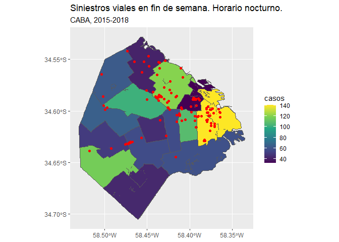

Análisis Exploratorio de Datos: Siniestros viales en la Ciudad de Buenos Aires (2015-2018). Parte II (R)
================

## Visualización de datos geográficos

A continuación se presenta un análisis sobre las víctimas de siniestros viales ocurridos en la Ciudad de Buenos Aires, Argentina, desde el año 2015 hasta el 2018. Se indagará la relación entre la cantidad de locales bailables y el número de víctimas para cada comuna. Los datasets fueron descargados de [data.buenosaires.gob.ar](data.buenosaires.gob.ar) y de [Ciencia de datos para gente sociable](https://bitsandbricks.github.io/ciencia_de_datos_gente_sociable/index.html).

Podés ver [acá](https://github.com/mnrodriguez28/data-analysis-portfolio/blob/main/proyectos/eda-siniestros-viales/eda-siniestros-i.ipynb) la *Parte I: Víctimas de siniestros viales. Análisis exploratorio de datos*.

#### Importando librerías

Primero, importamos las librerías que nos van a ayudar en el manejo y visualización de los datos: dplyr, lubridate, ggplot y sf.

``` r
library(dplyr)
library(lubridate)
library(ggplot2)
library(sf)
```

#### Cargando los datos

Luego, cargamos los datos con las funciones `read.csv()` y `st_read()`.

``` r
siniestros <- read.csv("victimas-siniestros-2015-2018.csv")
locales <- read.csv("locales-bailables.csv")
radios <- st_read("https://bitsandbricks.github.io/data/CABA_rc.geojson")
```

-   `siniestros` contiene fecha y ubicación del accidente vial y tipo de transporte involucrado. Además se especifica el género y edad de las víctimas y el tipo de lesión sufrida.

-   `locales` contiene datos georreferenciados de los locales bailables ubicados en la Ciudad de Buenos Aires.

-   `radios` contiene información geográfica de los radios censales de CABA. Además, incluye barrio, comuna, población total y cantidad de viviendas y hogares de cada radio.

#### Preparando los datos

``` r
dim(siniestros)
```

    ## [1] 33234    29

Como vimos en la Parte I, `siniestros` contiene 33234 filas y 29 columnas pero, para este análisis, sólo vamos a utilizar los accidentes que ocurrieron los fines de semana (viernes, sábado y domingo) entre las 00:00 y 08:00 hs. Para esto, primero transformamos la variable `hora` en el tipo de dato datetime y, luego, filtramos por día y horario y agrupamos por comuna para tener el total de accidentes por cada una de ellas.

``` r
siniestros_fecha <- siniestros %>%
    mutate(fecha = parse_date_time(fecha, order = "mdy")) %>%
    mutate(fecha = wday(fecha, label = TRUE))
```

``` r
siniestros_fines <- siniestros_fecha %>%
    rename(COMUNA = comuna) %>%
    mutate(fecha = as.character(fecha)) %>%
    mutate(fecha = substr(fecha, 1, 3)) %>%
    filter(hms(hora) <= hms("8:00:00"), fecha %in% c("sab", "dom")) %>%
    group_by(COMUNA) %>%
    mutate(COMUNA = as.factor(COMUNA)) %>%
    summarise(casos = n()) %>%
    filter(!is.na(COMUNA))
```

| COMUNA |  casos|
|:-------|------:|
| 1      |    140|
| 2      |     32|
| 3      |    107|
| 4      |     59|
| 5      |     57|
| 6      |     45|
| 7      |     57|
| 8      |     43|
| 9      |    116|
| 10     |     50|
| 11     |     65|
| 12     |     63|
| 13     |     41|
| 14     |    120|
| 15     |    101|

En segundo lugar, seleccionamos de `radios` las variables que nos van a ayudar a visualizar las comunas en un mapa. Además, unimos `comunas_geo` y `siniestros_fines` en un mismo dataframe.

``` r
comunas_geo <- radios %>%
    select(COMUNA, geometry) %>%
    group_by(COMUNA) %>% 
    count(COMUNA)
```

``` r
comuna_siniestros <- comunas_geo %>%
    left_join(siniestros_fines) %>%
    select(!n)
```

``` r
knitr::kable(
    head(comuna_siniestros)
)
```

| COMUNA | geometry                       |  casos|
|:-------|:-------------------------------|------:|
| 1      | POLYGON ((-58.392 -34.60243... |    140|
| 2      | POLYGON ((-58.53065 -34.618... |     32|
| 3      | POLYGON ((-58.52876 -34.611... |    107|
| 4      | POLYGON ((-58.51486 -34.581... |     59|
| 5      | POLYGON ((-58.47516 -34.539... |     57|
| 6      | POLYGON ((-58.44609 -34.569... |     45|

Por último, transformamos las variables `longitud` y `latitud` de `locales` en objetos sf para su visualización en el mapa de comunas.

``` r
locales_sf <- st_as_sf(locales, coords = c("longitud", "latitud"), dim = "XY",
                 crs = 4326, na.fail = FALSE)
```

#### Visualización

``` r
ggplot() +
    geom_sf(data = comuna_siniestros, aes(fill = casos)) +
    scale_fill_viridis_c() +
    geom_sf(data = locales_sf, color = "red") +
    labs(title = "Siniestros viales en fin de semana",
         subtitle = "CABA, 2015-2018")
```



    ## Correlación de Spearman:  0.17

NOTA: podemos ver algunas líneas internas que han quedado como residuo de la unión de los radios censales. Aunque es un problema muy común, en este caso no afecta a nuestro análisis por lo que vamos a dejarlo así.

#### Conclusión

El mapa no muestra una relación clara entre la cantidad de locales bailables y los accidentes de tránsito. Por ejemplo, en la comuna 13 (al norte de CABA) están ubicados 16 locales pero presenta pocos casos de accidentes viales (40 aprox.). Mientras que la comuna 9 (ubicada en el suroeste), con sólo dos locales, cuenta con más de 100 accidentes. Así mismo, el coeficiente de correlación de Spearman (prueba no paramétrica; las variables no cumplen el supuesto de normalidad) fue de `0.17`, lo que indica una relación débil entre ambas variables.

Por esta razón, para futuros análisis deben considerarse otras variables, como por ejemplo la cantidad de avenidas, el diseño de las calles (flujo del tránsito) o el barrio.

| COMUNA |  casos|  locales|
|:-------|------:|--------:|
| 1      |    140|       43|
| 2      |     32|       18|
| 3      |    107|       11|
| 4      |     59|        1|
| 5      |     57|        3|
| 6      |     45|        2|
| 7      |     57|        9|
| 8      |     43|       NA|
| 9      |    116|        2|
| 10     |     50|        3|
| 11     |     65|        3|
| 12     |     63|        2|
| 13     |     41|       16|
| 14     |    120|       38|
| 15     |    101|        4|
